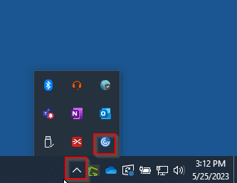

# Page With Image

This page tests local image embedding.

## The Logo

Here is our logo:

And here is text after the image.

## Missing Image

This references a file that doesn't exist:

It should show a placeholder instead of crashing.
